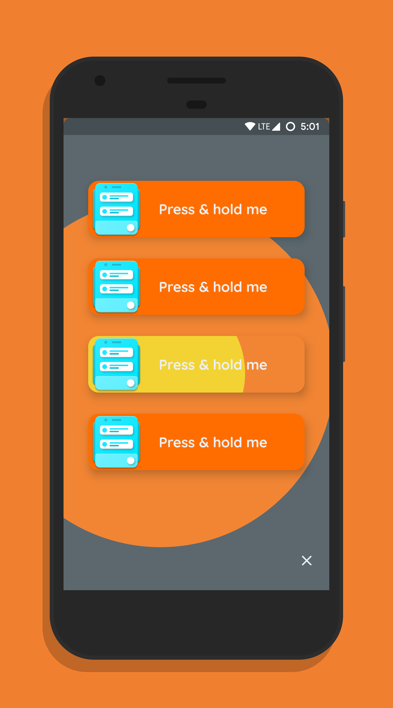

# Dashboard Reborn✨

A very sexy app template with great focus on UI, design and animations. It is written entirely in Dart and built with Flutter, so it can be compiled to run (very smoothly) on Android, iOS and all other platforms supported by Flutter!

Note: I am _not_ a UI designer by any means. All the animations, colors, layouts, etc. have been made according to what I thought looked "nice and cool"🙃

## Screenshots

    

## UI Demos

  

